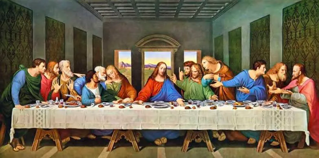

As you read this, someone somewhere is claiming to own something. A song, a photoshoot, a painting or even the right to love and whom to love. The list is endless.

In most of these cases, the right of ownership is never actualized. Other times, they are actualized but with great effort and sweat.

But what do NFTs have to do with these? Let’s find out. 

# NFTs, meaning Non-Fungible Tokens.

Fungibility simply means that ‘’it can be exchanged for another of its kind’’

For example, a $10 note is fungible because it can be exchanged for 2 $5 notes and still retain the same value.

Therefore, NFTs are unique digital commodities that cannot be exchanged or substituted for another of its kind and get the same value.

For instance, if Leonardo Da Vinci were to convert the painting ‘’The Last supper’’ into 10 limited NFTs, they would not have the same value. Why? Because although it is limited, everyone would want to OWN the painting of the Grand Maestro. This means, the higher the demand, the higher the price.

Maestro would be so rich, umph!

# But how do these apply to you?

One of the beauties of NFTs is the Right of Ownership. Tangible and intangible things can be converted to NFTs and be owned. Basically, you can own anything you desire once it has been converted into NFT, including this article you’re reading. 

# How does this work?

Remember when we talked about Blockchain and how difficult it is to tamper with information there? Perfect! NFTs are stored on the Blockchain which gives it a unique owner’s signature.

I can convert this article to NFT and put it up for sale. A popular platform for NFT sales is Opensea. You can buy it for X-amount, and it would be out of bounds for me to wake up tomorrow and claim that I still own this article. Isn’t that something!? I mean, the tussle between singers and songwriters can end here and now. 

# What’s more?

This technology keeps advancing and in April 2022, the first ever NFT marriage certificate was minted (created). This was all done on the foundation of the Blockchain technology and metaverse.

Put it this way; if your community does not support the kind of relationship you’re in and they refuse to be a part of your love adventure, you don’t have to worry. All you need to do is get on metaverse, create (people), design your wedding, have your wedding, print a certificate and there goes your happily ever after. 
